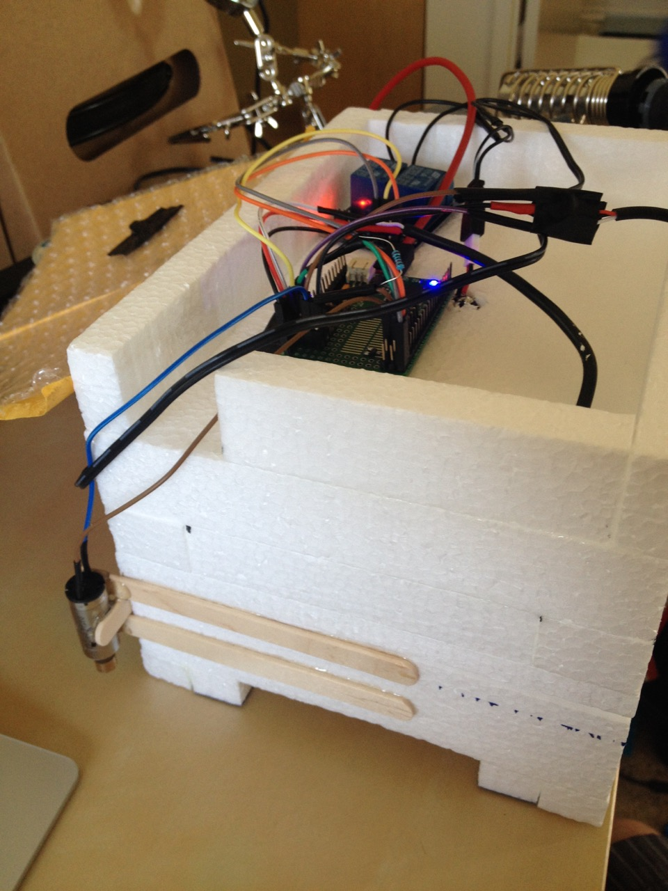
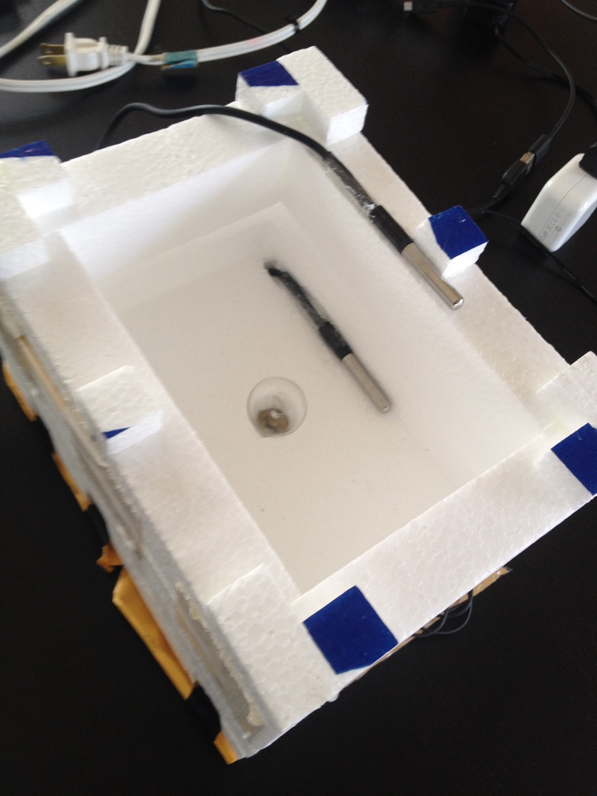

# Espruino Clear Ice Icebox

Here is code for an [Espruino-powered](http://www.espruino.com/) box designed to make perfectly clear ice.  The idea is to freeze the water directionly from the 
bottom of the ice cube to the top.  The box is placed in the freezer, and a heater keeps the top of the ice cube at just
slightly higher temperature than the outside, in theory allowing the trapped air to get out.

The code works perfectly.  As for clear ice?  Eh, not so much.

Posted here in case someone has a use for it.

Notable features:

* Tracks temperature from two censors.
* Turns on the heater using a given hysteresis value
* Bluetooth LE connectivity to your iPhone (iPhone app not included here)
* BLE communication via REST-like calls
* Vibrating motor to "stir up the water" while it's freezing (not real effective tho)

Here's a graph of a normal ice-cube freeze.

Here's what the last version of the ice cooler box looked like:

License
-------
Copyright (c) 2011-2013 John Baumbach <john.j.baumbach@gmail.com>

This program is free software: you can redistribute it and/or modify it under the terms of the GNU General Public License as published by the Free Software Foundation, either version 3 of the License, or (at your option) any later version.

This program is distributed in the hope that it will be useful, but WITHOUT ANY WARRANTY; without even the implied warranty of MERCHANTABILITY or FITNESS FOR A PARTICULAR PURPOSE.  See the GNU General Public License for more details.

You should have received a copy of the GNU General Public License along with this program.  If not, see <http://www.gnu.org/licenses/>.

